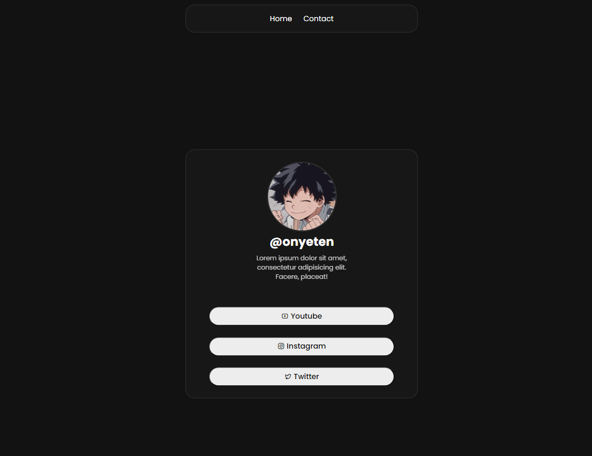

# QuickLinkShare

QuickLinkShare is a web application that allows users to easily share links. Whether it's sharing interesting articles, useful resources, or favorite websites. 🌐📚

 
<strong>
<samp>

[English](README.md) · [Polski](README.pl.md)

</samp>
</strong>

## Getting Started 🚀

To get started with QuickLinkShare, follow these steps:

1. Clone the repository: `git clone https://github.com/onyeten1337/QuickLinkShare.git` 📥
2. Navigate to the project directory 📂
3. Open the application in your preferred web browser 🌐

## 💻 Technologies Used

- HTML
- CSS

## License 📝

This project is licensed under the [MIT License](LICENSE).
